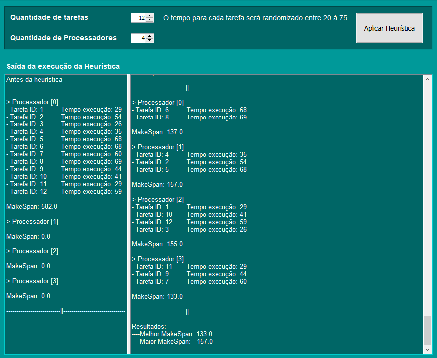

## Busca local para o Problema de Processamento de Tarefas

> **Problema de Processamento de Tarefas:**
Dado um conjunto com “n” tarefas, onde cada tarefa possui um tempo de processamento, e “m” processadores, que executam em paralelo, descobrir qual é o menor makespan  (tempo requerido para executar todas as tarefas).

+ Para este, fora utilizado de uma busca local monótona.
